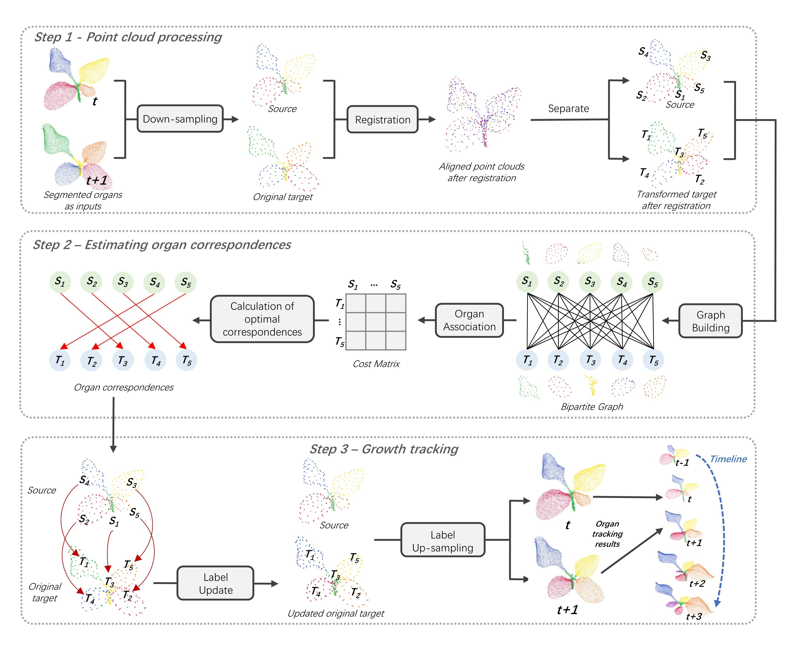

# TrackPlant3D: 3D organ growth tracking framework for organ-level dynamic phenotyping

This repo contains the official codes for the paper:

[Li, D.†](https://davidleepp.github.io/), Liu, L.†, Xu, S., & Jin, S.* (2024). TrackPlant3D: 3D organ growth tracking framework for organ-level dynamic phenotyping. <i>Computers and Electronics in Agriculture</i>, 226, 109435.

<ins>†</ins> *Equal contribution* 

[[Paper](https://www.sciencedirect.com/science/article/abs/pii/S0168169924008263)] 

[[Video presentation (12 minutes)](https://www.bilibili.com/video/BV1mKYSeZErt)] 

## Prerequisites
- Python == 3.7
- matplotlib == 3.3.4
- numpy == 1.19.5
- scipy == 1.5.4

## Introduction
The extraction of dynamic plant phenotypes is highly important for understanding the process of plant phenotype formation and formulating growth management plans. Although rapid progress has been made in the analysis of the efficiency and throughput of static phenotypes, dynamic growth tracking methods are still a key bottleneck for dynamic phenotyping. The major challenges related to organ growth tracking include the nonrigid deformation of organ morphology during growth, the high frequency of growth events, and a lack of spatiotemporal datasets. 

Inspired by the phenomenon in which a human naturally compares two similar three-dimensional objects by overlapping and aligning them, this study proposes an automatic organ growth tracking framework—TrackPlant3D—for time-series crop point clouds. The unsupervised framework takes crop point clouds at multiple growth stages with organ instance labels as input and produces point clouds with consistent organ labels as organ-level growth tracking outputs. Compared with the other two state-of-the-art organ tracking methods, TrackPlant3D has better tracking performance and greater adaptability across species. 

In an experiment involving maize species, the long-term and short-term tracking accuracies of TrackPlant3D both reached 100%. For sorghum, tobacco and tomato crops, the long-term tracking accuracies were 81.25%, 64.13% and 86.75%, respectively, and the short-term tracking accuracies were all greater than 85.00%, demonstrating satisfactory tracking performance. Moreover, TrackPlant3D is also robust against frequent organ growth events and adaptable to different types of segmentation inputs as well as to inputs involving inclination and rotation disturbances. We also demonstrated that the TrackPlant3D framework has the potential for incorporation into a fully automatic dynamic phenotyping pipeline that integrates organ segmentation, organ tracking, and dynamic monitoring of phenotypic traits such as individual leaf length and leaf area. This study may contribute to the development of dynamic phenotyping, digital agriculture, and the factory production of plants.

***
Overall TrackPlant3D framework for tracking organ growth in time-series plant point clouds. The framework includes three main steps—Step 1, point cloud processing; Step 2, estimating organ correspondences; and Step 3, growth tracking*** 
  

## Quick Start
The project contains five folders. 
Folder __[data]__ contains four subfolders corresponding to the original data, sampled data, registration results, and tracking results, respectively.  
Folder __[downsampling]__ contains code for downsampling the original point clouds. 
Folder __[registration]__ contains code for registration of point clouds. 
Folder __[tracking]__ contains code for tracking plant organs. 
Folder __[evaluation]__ contains code for calculating the evaluation metrics of plant organ tracking results. 

### Downsampling  
Downsampling the point cloud can reduce the computational burden and the time cost for registration.In downsampling process, 3D Edge‑Preserving Sampling (3DEPS) [1] is used to downsample the point cloud.
- File `001Batch separation of edges and centers of point clouds(c++).cpp` is used to separate original plant point clouds into point clouds containing only edge points and point clouds containing only non-edge points (in batches), respectively.
- File `002Merge edge and non-edge parts by assigned number.py` uses FPS to randomly sample 4096 points from both the edge part and the non-edge part, and combine the two parts into a new point cloud with 4096+4096 points.
- File `003Composite point clouds proportionally and data augmentation.py` uses FPS to sample 256*(ratio) points from the edge part from the 8192-point entity, and meanwhile to sample 256*(1-ratio) points from the non-edge part from the 8192-entity. Then, merges the two parts into a new simple point cloud with 256 points. Finally, normalizes the downsampled point cloud in scale. Please be noted that data augmentation is not required in our experiments.

### Registration 
The Coherent Point Drift (CPD) [2], a non-rigid registration method, is used to align every two point clouds (from two adjacent moments) of the same plant.  
- The input of registration is the downsampled data saved in folder `./data/sampled_data`. 
- The output of registration will appear in folder `./data/registration_result` after running the Registration
- File `fish_deformable_3D_lowrank_my.py` takes the point cloud at time ***t-1*** and the point cloud at time ***t*** as dual inputs and returns the transformed point cloud at time ***t***. The CPD algorithm deformed the point cloud at time ***t*** to match the shape of the point cloud at time ***t-1***.

### Tracking 
Our organ tracking algorithm obtains organ correspondences through Minimum Weighted Perfect Matching (MWPM) on an extended cost matrix for matching organs from two adjacent moments.  
- The input of tracking is registration results at time ***t*** in folder `./data/registration_result` and the downsampled point cloud at time ***t-1*** in folder `./data/sampled_data`. 
- The output are point clouds whose labels are upsampled to propagate to the original point clouds will be saved in `./data/tracking_result`.
- File `organ_matching.py` estimates the organ correspondences between point cloud at time ***t-1*** and point cloud at time ***t***.
- Folder `./tracking/cost` stores the extended cost matrix of each tracking.
- Folder `./tracking/col` stores the organ correspondences of each tracking.

### Evaluation
- The input is GTs in folder `./data/original_data/gt` and tracking results in folder `./data/tracking_result`.
- Files `match.py` and `evalutaion.py` should be executed in turn to obtain quantitative metrics.
- The output will be stored in the current folder.

[1] Li, D., Shi, G., Li, J., Chen, Y., Zhang, S., Xiang, S., & Jin, S. (2022). PlantNet: A dual-function point cloud segmentation network for multiple plant species. ISPRS Journal of Photogrammetry and Remote Sensing, 184, 243-263.

[2] Myronenko, A., & Song, X. (2010). Point set registration: Coherent point drift. IEEE transactions on pattern analysis and machine intelligence, 32(12), 2262-2275.
